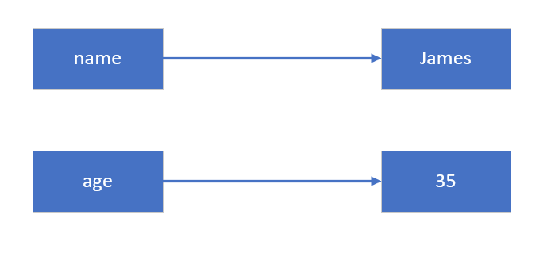

# Task05：字典、字符串

## 1. 字典

map是一种较为特殊的数据结构，在任何一种编程语言中都可以看见他的身影，它是一种键值对结构，通过给定的key可以快速获得对应的value。

### 1.1 如何定义字典

```go
var m1 map[string]int
m2 := make(map[int]interface{}, 100)
m3 := map[string]string{
	"name": "james",
	"age":  "35",
}
```



在定义字典时不需要为其指定容量，因为map是可以动态增长的，但是在可以预知map容量的情况下为了提高程序的效率也最好提前标明程序的容量。需要注意的是，不能使用不能比较的元素作为字典的key，例如数组，切片等。而value可以是任意类型的，如果使用interface{}作为value类型，那么就可以接受各种类型的值，只不过在具体使用的时候需要使用类型断言来判断类型。

### 1.2 字典操作

向字典中放入元素也非常简单

```go
m3["key1"] = "v1"
m3["key2"] = "v2"
m3["key3"] = "v3"
```

你可以动手试一下，如果插入的两个元素key相同会发生什么？

与数组和切片一样，我们可以使用len来获取字典的长度。

```go
len(m3)
```

在有些情况下，我们不能确定键值对是否存在，或者当前value存储的是否就是空值，go语言中我们可以通过下面这种方式很简便的进行判断。

```go
if value, ok := m3["name"]; ok {
		fmt.Println(value)
	}
```

上面这段代码的作用就是如果当前字典中存在key为name的字符串则取出对应的value，并返回true，否则返回false。

对于一个已经存在的字典，我们如何对其进行遍历呢？可以使用下面这种方式：

```go
for key, value := range m3 {
		fmt.Println("key: ", key, " value: ", value)
}
```

如果多运行几次上面的这段程序会发现每次的输出顺序并不相同，对于一个字典来说其默认是无序的，那么我们是否可以通过一些方式使其有序呢？你可以动手尝试一下。（提示：可以通过切片来做哦）

如果已经存在与字典中的值已经没有作用了，我们想将其删除怎么办呢？可以使用go的内置函数delete来实现。

```go
delete(m3, "key1")
```

除了上面的一些简单操作，我们还可以声明值类型为切片的字典以及字典类型的切片等等，你可以动手试试看。

不仅如此我们还可以将函数作为值类型存入到字典中。

```go
func main() {
	m := make(map[string]func(a, b int) int)
	m["add"] = func(a, b int) int {
		return a + b
	}
	m["multi"] = func(a, b int) int {
		return a * b
	}
	fmt.Println(m["add"](3, 2))
	fmt.Println(m["multi"](3, 2))
}
```

## 2. 字符串

字符串应该可以说是所有编程语言中最为常用的一种数据类型，接下来我们就一起探索下go语言中对于字符串的常用操作方式。

### 2.1 字符串定义

字符串是一种值类型，在创建字符串之后其值是不可变的，也就是说下面这样操作是不允许的。

```go
s := "hello"
s[0] = 'T'
```

编译器会提示`cannot assign to s[0]`。在C语言中字符串是通过`\0`来标识字符串的结束，而go语言中是通过长度来标识字符串是否结束的。

如果我们想要修改一个字符串的内容，我们可以将其转换为字节切片，再将其转换为字符串，但是也同样需要重新分配内存。

```go
func main() {
	s := "hello"
	b := []byte(s)
	b[0] = 'g'
	s = string(b)
	fmt.Println(s) //gello
}
```

与其他数据类型一样也可以通过`len`函数来获取字符串长度。

```go
len(s)
```

但是如果字符串中包含中文就不能直接使用byte切片对其进行操作，go语言中我们可以通过这种方式

```go
func main() {
	s := "hello你好中国"
	fmt.Println(len(s)) //17
	fmt.Println(utf8.RuneCountInString(s)) //9

	b := []byte(s)
	for i := 0; i < len(b); i++ {
		fmt.Printf("%c", b[i])
	} //helloä½ å¥½ä¸­å�½
	fmt.Println()

	r := []rune(s)
	for i := 0; i < len(r); i++ {
		fmt.Printf("%c", r[i])
	} //hello你好中国
}
```

在go语言中字符串都是以utf-8的编码格式进行存储的，所以每个中文占三个字节加上hello的5个字节所以长度为17，如果我们通过`utf8.RuneCountInString`函数获得的包含中文的字符串长度则与我们的直觉相符合。而且由于中文对于每个单独的字节来说是不可打印的，所以可以看到很多奇怪的输出，但是将字符串转为rune切片则没有问题。

### 2.2 strings包

strings包提供了许多操作字符串的函数。在这里你可以看到都包含哪些函数https://golang.org/pkg/strings/。

下面演示几个例子：

```go
func main() {
	var str string = "This is an example of a string"
	//判断字符串是否以Th开头
	fmt.Printf("%t\n", strings.HasPrefix(str, "Th"))
	//判断字符串是否以aa结尾
	fmt.Printf("%t\n", strings.HasSuffix(str, "aa"))
	//判断字符串是否包含an子串
	fmt.Printf("%t\n", strings.Contains(str, "an"))
}
```

### 2.3 strconv包

strconv包实现了基本数据类型与字符串之间的转换。在这里你可以看到都包含哪些函数https://golang.org/pkg/strconv/。

下面演示几个例子：

```go
i, err := strconv.Atoi("-42") //将字符串转为int类型
s := strconv.Itoa(-42) //将int类型转为字符串
```

若转换失败则返回对应的error值。

### 2.4 字符串拼接

除了以上的操作外，字符串拼接也是很常用的一种操作，在go语言中有多种方式可以实现字符串的拼接，但是每个方式的效率并不相同，下面就对这几种方法进行对比。(关于测试的内容会放在后面的章节进行讲解，这里大家只要知道这些拼接方式即可)

**1.SPrintf**

```gogo
const numbers = 100

func BenchmarkSprintf(b *testing.B) {
	b.ResetTimer()
	for idx := 0; idx < b.N; idx++ {
		var s string
		for i := 0; i < numbers; i++ {
			s = fmt.Sprintf("%v%v", s, i)
		}
	}
	b.StopTimer()
}
```

**2.+拼接**

```go
func BenchmarkStringAdd(b *testing.B) {
	b.ResetTimer()
	for idx := 0; idx < b.N; idx++ {
		var s string
		for i := 0; i < numbers; i++ {
			s += strconv.Itoa(i)
		}
	}
	b.StopTimer()
}
```

**3.bytes.Buffer**

```go
func BenchmarkBytesBuf(b *testing.B) {
	b.ResetTimer()
	for idx := 0; idx < b.N; idx++ {
		var buf bytes.Buffer
		for i := 0; i < numbers; i++ {
			buf.WriteString(strconv.Itoa(i))
		}
		_ = buf.String()
	}
	b.StopTimer()
}
```

**4.strings.Builder拼接**

```go
func BenchmarkStringBuilder(b *testing.B) {
	b.ResetTimer()
	for idx := 0; idx < b.N; idx++ {
		var builder strings.Builder
		for i := 0; i < numbers; i++ {
			builder.WriteString(strconv.Itoa(i))
		}
		_ = builder.String()
	}
	b.StopTimer()
}
```

**5.对比**

```go
BenchmarkSprintf-8         	   68277	     18431 ns/op
BenchmarkStringBuilder-8   	 1302448	       922 ns/op
BenchmarkBytesBuf-8        	  884354	      1264 ns/op
BenchmarkStringAdd-8       	  208486	      5703 ns/op
```

可以看到通过strings.Builder拼接字符串是最高效的。

## 实战

### 字典

```go
package main

import "fmt"

func main()  {
	m := map[int]string{1:"mike",2:"yoyo"}
	value1,ok:=m[1]
	if ok{
		fmt.Printf("找到了：key = 1,value=%v \n", value1)
	}

	if value2,ok:=m[3];ok{
		fmt.Printf("找到了：key=3,value=%v\n", value2)
	}else{
		fmt.Print("没有找到！ \n")
	}
}
```

