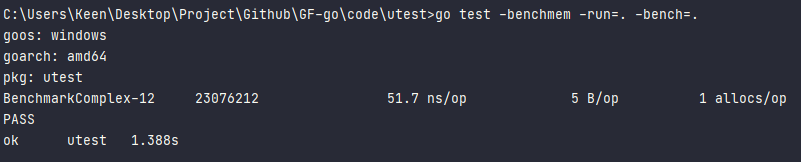

# Task12：单元测试

在日常开发中，我们通常需要针对现有的功能进行单元测试，以验证开发的正确性。在Go标准库中存在一个叫做	`testing`的测试框架，可以用于单元测试和性能测试。它是和命令`gotest`集成使用的。

测试文件是以后缀`_test.go`命名的，通常和被测试的文件放在同一个包中。

## 1. 初探

Go语言中的测试依赖`go test`命令。编写测试代码和编写普通的Go代码过程是类似的，并不需要学习新的语法、规则或工具。

go test命令是一个按照一定约定和组织的测试代码的驱动程序。在包目录内，所有以`_test.go`为后缀名的源代码文件都是`go test`测试的一部分，不会被`go build`编译到最终的可执行文件中。

在`*_test.go`文件中有三种类型的函数，单元测试函数、基准测试函数和示例函数。

| 类型     | 格式                  | 作用                           |
| :------- | :-------------------- | :----------------------------- |
| 测试函数 | 函数名前缀为Test      | 测试程序的一些逻辑行为是否正确 |
| 基准函数 | 函数名前缀为Benchmark | 测试函数的性能                 |
| 示例函数 | 函数名前缀为Example   | 为文档提供示例文档             |

`go test`命令会遍历所有的`*_test.go`文件中符合上述命名规则的函数，然后生成一个临时的main包用于调用相应的测试函数，然后构建并运行、报告测试结果，最后清理测试中生成的临时文件。

## 2. 单测要点

第一：单元测试的时候，如果有一些打印log信息，我们运行xxx_test.go是输出不出来的，此时需要使用：

```
go test xxx_test.go -v
```

使用-v参数可以帮助我们解决此问题。

> error：dial tcp 172.217.24.17:443: connectex: A connection attempt failed because t
>
> - 当出现上述错误时，执行 go env -w GOPROXY=[https://goproxy.cn](https://goproxy.cn/) 换一个国内的代理地址，则可以进行访问。

第二：单测覆盖率，覆盖率可以简单理解为进行单元测试mock的时候，能够覆盖的代码行数占总代码行数的比率，当然是高一点要好些。可以通过`-cover`指定

```
go test xxx_test -v -cover
```

第三：在上述提到的测试方法中我们使用的是(table-driven tests)表格驱动型测试，我们看一下代码：

```
tests := []struct {
	name string
	args args
	want *Complex
}{
	// TODO: Add test cases.
	{
		name: "",
		args: args{
			a: Complex{
				Real: 1.0,
				Imag: 2.0,
			},
			b: Complex{
				Real: 1.0,
				Imag: 1.0,
			},
		},
		want: &Complex{
			Real: 2.0,
			Imag: 3.0,
		},
	},
}
```

在TODO里面我们可以填写很多单元测试样例。


## 3. 基准测试

基准测试函数名字必须以Benchmark开头，代码在xxx_test.go中。具体如下：

```
func BenchmarkComplex(t *testing.B) {
	for i := 0; i < t.N; i++ {
		fmt.Sprintf("hello")
	}
}
```

运行：

```
go test -benchmem -run=. -bench=.
输出：
goos: linux
goarch: amd64
BenchmarkComplex-8   	20542494	        58.9 ns/op	       5 B/op	       1 allocs/op
PASS
ok  	_/home/light/go_dev/go-talent/code/utest	1.272s
```



20542494表示for循环的测试，58.9表示每次需要花费58.9纳秒。 `-benchmem`可以提供每次操作分配内存的次数，以及每次操作分配的字节数。 allocs/op 表示每次操作从堆上分配内存的次数。B/op 表示每次操作分配的字节数。

## 4. mock/stub测试

> 【mooc介绍】[教你使用Mock完成单元测试 - 知乎 (zhihu.com)](https://zhuanlan.zhihu.com/p/98074553)

gomock是官方提供的mock框架，同时有mockgen工具来辅助生成测试代码。

> https://github.com/golang/mock

需要自己先安装一下：

```
go get -u github.com/golang/mock/gomock
go get -u github.com/golang/mock/mockgen
```

下面以DB为例，有如下接口：

```
type DB interface {
	Get(key int) (string, error)
}
```

我们想通过Get接口返回对应value。于是写出了下面这个函数：

```
func GetValue(db DB, key int) (string, error) {
	value, err := db.Get(key)
	if err != nil {
		return "", errors.New("fail")
	}
	return value, nil
}
```

我们现在比较关心的是当前我们写的函数是否正确，而中间调用了Get接口，该接口我们可以进行mock，首先使用下面命令：

```
mockgen -source=db.go -destination=db_mock.go -package=db
```

随后在单元测试文件中进行go mock即可。

```
func TestGetValue(t *testing.T) {
	ctrl := gomock.NewController(t)
  defer ctrl.Finish()

	m := NewMockDB(ctrl)
	m.EXPECT().Get(gomock.Eq(1)).Return("我是1的value", nil)

	if v, err := GetValue(m, 1); err != nil {
		t.Error(err)
	} else {
		t.Log(v)
	}
}
```

其中比较重要的是打桩(stubs)：

```
m.EXPECT().Get(gomock.Eq(1)).Return("我是1的value", nil)
```

这一行我们mock掉了Get接口，假设其返回字符串(我是1的value)与nil，随后进行逻辑测试。

这种方式的好处是不直接依赖的实例，而是使用依赖注入降低耦合性。

## 5. 直接替换

在1.4中我们是需要进行打桩并使用mockgen才可以完成一些复杂api的测试的，那有没有更简单的方法呢，例如：直接替换函数为想要的函数，在github上有monkey库为我们使用。

输入下面命令进行安装：

> go get github.com/bouk/monkey

假设有Get接口的实现者是Handler，那么我们直接使用monkey进行方法替换，把Get方法替换为我们自己的，仅此一步搞定单元测试，非常方便。

```
func TestGetValue1(t *testing.T) {
	var h *Handler
	monkey.PatchInstanceMethod(reflect.TypeOf(h), "Get", func(handler *Handler, key int) (string, error) {
		return "我是1的value", nil
	})
	if v, err := GetValue(h, 1); err != nil {
		t.Error(err)
	} else {
		t.Log(v)
	}
}
```

## 6. 浏览器实时测试

接下来引入一个比较方便的单元测试框架，可以在浏览器进行实时查看单元测试结果。只需要三步即可。

第一步：

```
go get github.com/smartystreets/goconvey
```

第二步：

```
$GOPATH/bin/goconvey
```

第三步：

```
http://localhost:8080
```

此时在页面可以看到下面这个。


除此之外，我们看到使用vscode生成的单元测试(table-driven tests)贼丑，那么我们可以使用convey进行单测。

```
func TestSpec(t *testing.T) {
	// Only pass t into top-level Convey calls
	Convey("Given some integer with a starting value", t, func() {
		x := 1
		Convey("When the integer is incremented", func() {
			x++
			Convey("The value should be greater by one", func() {
				So(x, ShouldEqual, 2)
			})
		})
	})
}
```

使用convey进行包裹起来会十分好看。

## 参考

1. [Go语言基础之单元测试](https://www.cnblogs.com/nickchen121/p/11517443.html)

2. [go-talent](https://github.com/datawhalechina/go-talent)